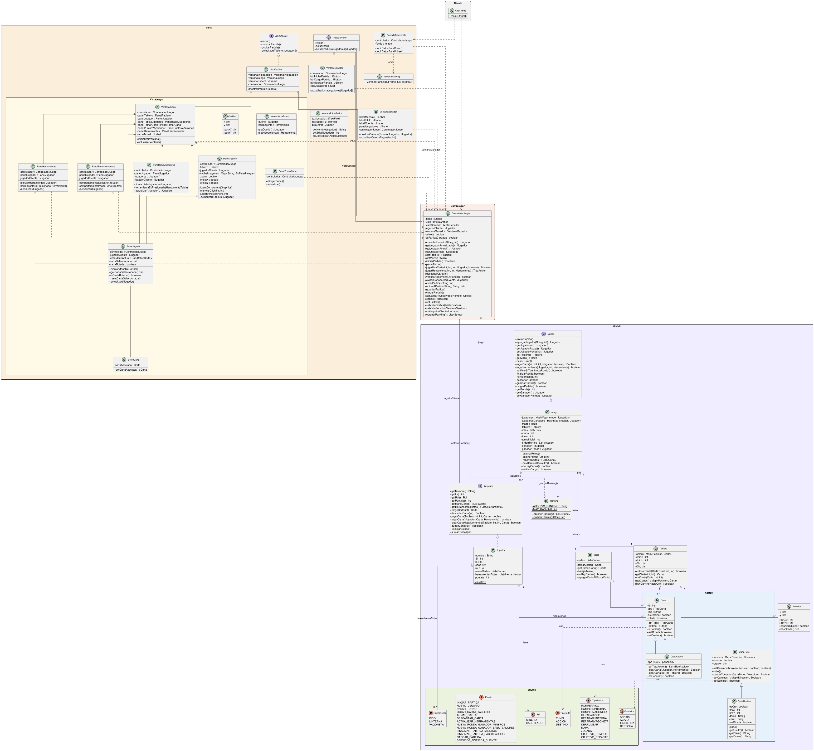

# 🪨 Saboteur

Implementacion digital del juego de cartas **Saboteur** con multijugador en red, interfaz grafica y arquitectura MVC distribuida.

---


## 🎲 Reglas del juego

La partida se juega en **3 rondas**. Al inicio de cada ronda, cada jugador recibe su mano de cartas y un **rol secreto**: Minero o Saboteador.

El tablero tiene una carta de **Inicio** en el centro y tres cartas boca abajo en el extremo: una es el **Oro** y dos son **Carbon**, colocadas aleatoriamente.

**En su turno, cada jugador debe hacer una de estas acciones:**
- 🪨 **Colocar una carta de tunel** en el tablero, conectada a los caminos existentes y partiendo desde el Inicio.
- ⚔️ **Jugar una carta de accion** sobre si mismo o sobre otro jugador (romper o reparar herramientas, derrumbar un tunel o revelar un destino).
- 🗑️ **Descartar una carta** de su mano si no puede o no quiere jugar.

Luego de jugar o descartar, el jugador roba una carta del mazo.

**Un jugador con herramientas rotas no puede colocar cartas de tunel** hasta que alguien lo repare.

**La ronda termina cuando:**
- Un minero conecta un camino desde el Inicio hasta el Oro → **ganan los Mineros**.
- Se acaban las cartas y nadie llego al Oro → **ganan los Saboteadores**.

**Puntuacion:** el minero que encontro el oro recibe mas pepitas; el resto de los mineros reciben menos en orden de turno. Los saboteadores reciben un valor fijo segun cuantos son. Al cabo de 3 rondas, **gana el jugador con mas pepitas**.


---

## 🛠️ Tecnologias

- **Java** · **Swing** · **Java RMI** · **MVC**
- `LibreriaRMIMVC.jar` — framework MVC sobre RMI (UNLu)
- `MigLayout` — layout manager para Swing
- **Java Serialization** — persistencia de partidas

---

## 🏗️ Arquitectura

El proyecto sigue el patron **MVC**: el Modelo vive en el servidor y se accede remotamente via RMI. Cada cliente tiene su propio Controlador y Vista.

```
src/
├── Saboteur.java              # Entry point
├── Controlador/
│   └── Controlador.java       # Mediador MVC + cliente RMI
├── Modelo/
│   ├── Juego.java             # Logica central (Observable RMI)
│   ├── Tablero.java           # Grilla + pathfinding BFS
│   ├── Mazo.java              # Mazo con barajado
│   ├── Jugador.java           # Entidad jugador (Serializable)
│   ├── Cartas/                # CartaTunel, CartaAccion, CartaDestino
│   └── Enums/                 # Evento, Rol, Herramienta, Direccion...
└── Vista/
    ├── PantallaBienvenida.java # Crear / unirse a partida
    ├── VistaGrafica.java       # Vista principal del cliente
    ├── VentanaServidor.java    # Panel del host
    ├── VentanaGanador.java     # Pantalla de fin de ronda
    └── VistaJuego/            # Tablero, mano, herramientas, jugadores
```

---

## ✨ Funcionalidades

- Multijugador en red local (3–10 jugadores)
- Roles secretos asignados aleatoriamente segun cantidad de jugadores
- Colocacion de cartas de tunel con validacion de conexiones direccionales
- Algoritmo DFS para detectar si hay camino hasta el oro
- Cartas de accion: romper/reparar herramientas, mapa, derrumbe
- Rotacion de cartas 180° antes de colocarlas
- Guardar y cargar partidas (serializacion Java)
- Sistema de puntuacion fiel al reglamento original

---

🚀 Como ejecutar
Requisitos: JDK 16+. Las dependencias (LibreriaRMIMVC.jar y miglayout15-swing.jar) estan incluidas en la raiz del proyecto.

- Compilar el proyecto incluyendo ambos JARs en el classpath
- Ejecutar la clase principal Saboteur

Crear partida (host): elegir IP local y puerto → ingresar nombre y edad → esperar jugadores → Iniciar Partida.
Unirse: ingresar IP del servidor, IP propia y puerto → ingresar nombre y edad.

> Para jugar varios clientes en la misma PC, usar 127.0.0.1 con puertos distintos por instancia.
---

## 📐 Diagrama UML


## 👤 Autor

| | |
|---|---|
| **Nombre** | Juan Espinosa D |
| **Legajo** | 195160 |
| **Materia** | Programacion Orientada a Objetos |
| **Universidad** | Universidad Nacional de Lujan (UNLu) |
